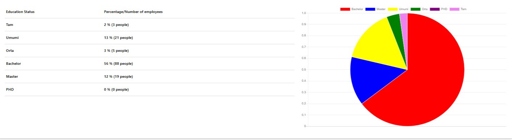

## About Project

The task was to build a platform which gets raw data of different departments from various sources through REST APIs, analyzes those data to retrieve necessary information and generate visual reports on monnthly bases. 

## Used Technologies
<ul>
    <li>Backend of Dashboard created with Laravel 5.8</li>
    <li>Frontend created with Materializecss 1.0</li>
    <li>Graphics and statistic charts created with ChartJS</li>
</ul>
 

